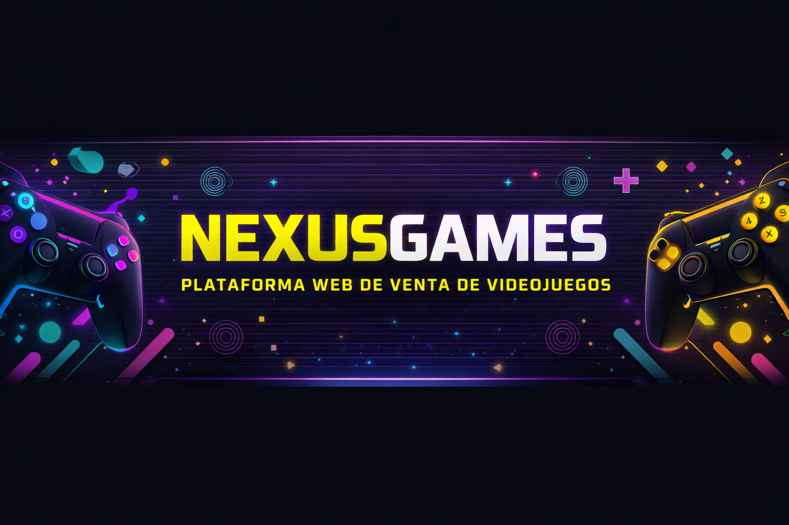
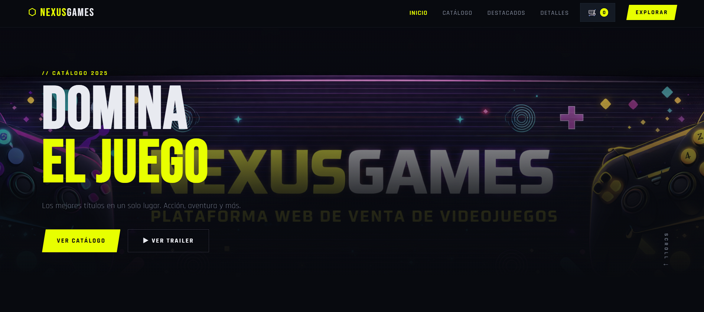

<h1 align="center">🎮 NexusGames</h1>
<h3 align="center">Plataforma Web de Venta de Videojuegos</h3>

<p align="center">

</p>

---

# 🛠 Tecnologías utilizadas

<p align="center">


</p>

---

# 📌 Descripción

**NexusGames** es una plataforma web diseñada para la exploración y compra de videojuegos, permitiendo a los usuarios descubrir títulos populares, ver trailers y explorar diferentes categorías mediante filtros interactivos.

El objetivo del proyecto es ofrecer una **experiencia visual moderna inspirada en el mundo gaming**, donde los usuarios puedan encontrar fácilmente los mejores videojuegos.

---

# 🚀 Funcionalidades

### 🎬 Trailer de juegos

Los usuarios pueden ver trailers de videojuegos directamente en la plataforma para conocer mejor cada título.

### 🆕 Novedades

Sección donde se muestran los juegos más recientes añadidos al catálogo.

### 🔥 Juegos más vistos

Lista de los juegos que han tenido mayor número de visualizaciones dentro del sitio.

### 🏆 Top Vendidos

Muestra los videojuegos más vendidos, destacando los títulos más populares entre los usuarios.

### ⭐ Juegos recomendados

Sección con recomendaciones destacadas para ayudar a los usuarios a descubrir nuevos juegos.

### 🔎 Filtro de búsqueda

Sistema de filtrado que permite encontrar juegos según diferentes criterios:

* Popularidad
* Ventas
* Novedades
* Recomendaciones

Esto facilita una **búsqueda rápida y eficiente dentro del catálogo**.

---

# 🖼 Screenshots del proyecto

### Página principal



---

### Sección de juegos


---

### Filtro de videojuegos


---

# 📥 Instalación

Sigue estos pasos para ejecutar el proyecto en tu computadora:

### 1️⃣ Clonar el repositorio

```bash
git clone https://github.com/Chernobyl25/nexus.git
```

---

### 2️⃣ Entrar a la carpeta del proyecto

```bash
cd NexusGames
```

---

### 3️⃣ Abrir el proyecto

Puedes abrir el proyecto de dos formas:

**Opción 1 — Abrir directamente**

Abrir el archivo:

```
index.html
```

en tu navegador.

---

**Opción 2 — Usar un servidor local (recomendado)**

Si usas **VS Code**, instala la extensión:

```
Live Server
```

Luego:

1. Abre la carpeta del proyecto
2. Haz clic derecho en `index.html`
3. Selecciona **Open with Live Server**

---

# 📂 Estructura del proyecto

```
NexusGames/
│
├── index.html
├── estilos.css
├── script.js
│
├── media/
│   ├── juegos/
│   │   ├── banner.jpg
│   │   ├── juego1.jpg
│   │   ├── juego2.jpg
│   │
│   ├── screenshots/
│   │   ├── inicio.png
│   │   ├── juego.png
│   └── filtros.png 
│
└── README.md
```

---

# 🎨 Diseño

La interfaz del sitio está inspirada en el **estilo visual gaming**, utilizando colores vibrantes, efectos visuales y elementos modernos para mejorar la experiencia del usuario.

Características del diseño:

✔ Diseño moderno
✔ Interfaz atractiva
✔ Navegación sencilla
✔ Estilo visual gaming
✔ Botones interactivos

---

# 🔮 Mejoras futuras

* 🛒 Carrito de compras
* 👤 Sistema de usuarios
* ⭐ Sistema de calificaciones
* 💳 Integración de pagos
* 🎮 Base de datos de videojuegos

---

# 📊 Estadísticas del proyecto

## Lenguajes utilizados

<p align="center">


</p>

Esta gráfica muestra los lenguajes de programación utilizados dentro del proyecto.

---

## Estadísticas del repositorio

<p align="center">


</p>

---

# 🧠 Tecnologías principales

| Tecnología | Uso                                |
| ---------- | ---------------------------------- |
| HTML       | Estructura de la página web        |
| CSS        | Diseño y estilos visuales          |
| JavaScript | Interactividad y filtros de juegos |

---

# 🛠 Distribución aproximada del código

* 🟧 **HTML** → estructura de la plataforma
* 🟦 **CSS** → diseño gaming y estilos visuales
* 🟨 **JavaScript** → filtros, interacción y dinamismo del sitio

---


# 👀 Visitas

<p align="center">


</p>

---

# 📚 Proyecto educativo

Proyecto desarrollado con fines educativos para la práctica de **desarrollo web y diseño de plataformas digitales**.


```

